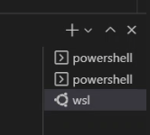
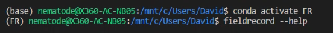
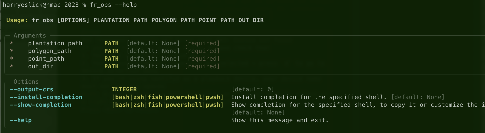

# Project name
Author(s): Corey Barrit, Harry Eslick
Creation date: eg. 2023-06-28 

## Project description:   
Code for automating the conversion of David's hand draw field data.
   
Inputs: 
- Hand drawn point vector data
- Hand drawn polygon vector data
- plantation layer to map the hand drawn data onto

Outputs: 
- hand drawn layers converted to plantations crs.
- plantations layer with pest data from hand drawn layers.
  

## Additional notes:   
This job has been quite confusing to implement and therefore it is hard to comprehend and make changes to. Sorry.
  
## Scripts:   
FieldRecord.py:   
Description: Main script.
Inputs:
- input vector layers listed above.
- set project crs

Config.    
column names and pest codes are hard coded in the mappings.py file. this can be edited pretty easily.   

fieldrecord.src.decode.py:   
Description: Takes CODEs in original format 'DB_Low_Med_' and converts to dictionary {'DB': ['Low', 'Med']}

fieldrecord.src.formatting.py:   
Description: 
- Converts dictionary format to final dataframe format. 
- DB & SN gets their own column. 
- Abiotic pests have a column.
- all other pests go into their own column
- severities for DB & SN go into the DB & SN columns.
- all other severities go into the severity column.

fieldrecord.src.process_points.py:   
Description: Intersects the hand drawn points layer with plantations layer. Also has the polygon/points merging function.

fieldrecord.src.process_polygons.py:   
Description: Intersects the hand drawn polygons layer with the plantations layer.

fieldrecord.src.utils.py:   
Description: Functions for setup of script (reading, setting crs, etc), and other misc. functions.

""   

""   

## Installation Instructions   
create python environment in conda    
`conda create -n fieldrecord python=3.11`   
activate environment   
`conda activate fieldrecord`   
install dependencies   
`pip install git+https://github.com/ArborCarbon/fieldrecord.git --force-reinstall`   

## Usage Instructions
### Davids Install
* start a WSL(Ubuntu) terminal in VSCode   
   
* Start the conda environment `conda activate FR`  
   

### run using the CLI
after installing the package you can run the script using the CLI.   
in the terminal type:   
`fieldrecord --help` to get further instructions      
it should look like this:   
   

enter the required arguments and the script will run. eg
`fieldrecord <path/to/plantations/layer> <path/to/observation/polygons> <path/to/observation/points> <path/to/output/folder>`

## Debugging / issues
The point + polygon data coming from Davids old software is not very clean. There are some issues which may arrise over time. known issues:
loading polygon layers returns:
`ValueError: A linearring requires at least 4 coordinates`
This error can be fixed by first loading the data in QGIS and saving it as a new layer. use functions:
    1. check validity
    2. fix geometries

The data are non-georeferenced. I think they will be in 4326. or the CRS matching the plantation layer....
this will cause some errors be aware of this. save a new copy with the correct CRS if are having trouble to rule this out. 

## TODO:
* If drawn polygon intersects less than XX% of the plantation polygon, exclude it as a likely digitization error (just add another column with these removed, for comparison)
* If multiple drawn polygons intersect a plantation polygon, include them all so Dave can review
* If no pest code is present, surfacde this so Dave can review

